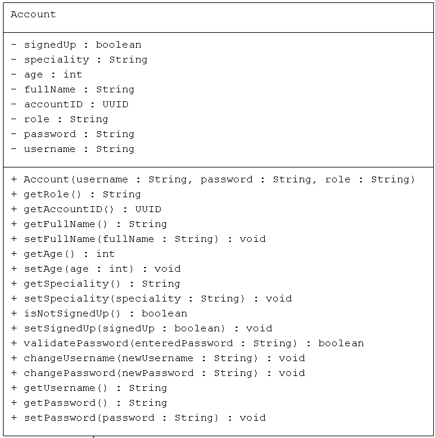
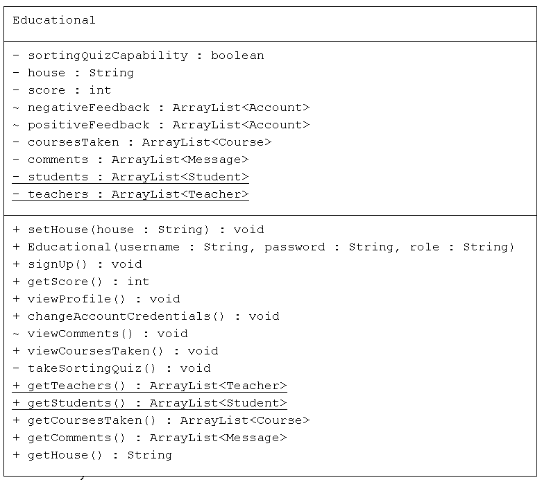
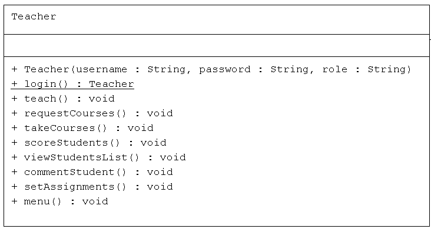
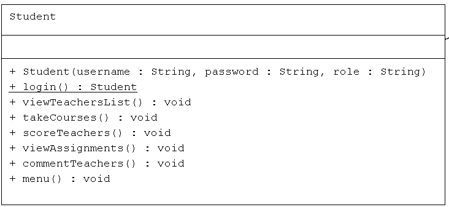
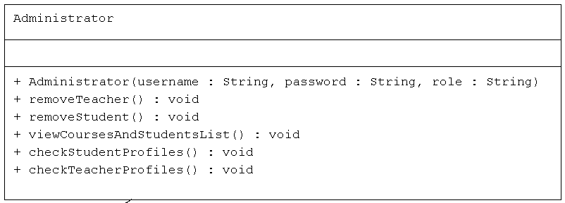
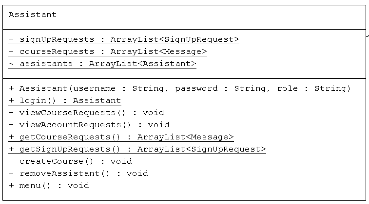
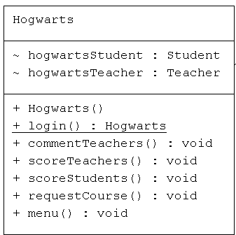
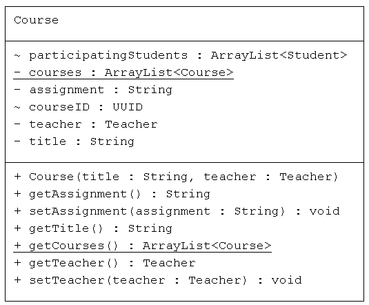
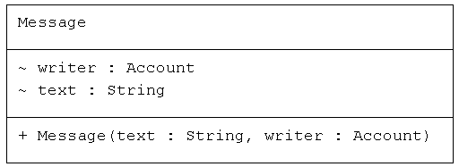
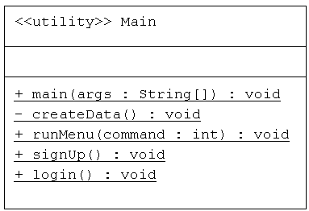

# CineScribe

Hogwarts School Management Program

## Description

Every person from student to *"Dumbledore"* Himself in Hogwarts school of witchcraft and wizardry can use this program to manage their activities.

## Getting Started

### Dependencies
* IntelliJ for running the code
* Gradle as package manager
* "org.junit.jupiter:junit-jupiter"
* "org.junit:junit-bom:5.9.1"
* "commons-codec:commons-codec:1.16.1" for hashing passwords

### Installing

* The app can be cloned from [*GitHub*](https://github.com/SrgtSajjad/AP-Third-Assignment-Hogwarts.git)
* Download Gradle 8.6 from [*Gradle*](https://gradle.org/releases/)
* Download IntelliJ IDEA community version from [*JetBrains*](https://www.jetbrains.com/idea/download/)
* Download Java from [*Oracle*](https://www.oracle.com/java/technologies/downloads/)

### Executing program

1. Run the program using IntelliJ
2. Enter login credentials from the ***"Account Credentials"*** listed below this section (program is case-sensitive)
3. Use the menu dedicated to each class by typing in the ***"number"*** of the option you would like to check out
4. **WARNING!** Do not enter strings if you are not asked, the program may crash
5. You can create new accounts by Signing Up and then logging into an assistant's  account and accepting your request
6. The rest of the program is self-explanatory
* * * 
### Account Credentials
* Teacher: 
  * Username: Snape
  * Password: 1234
* Student:
  * Username: Harry
  * Password: 1234
* Assistant: 
  * Username: Hermione
  * Password: 1234
* Hogwarts:
  * Username: Dumbledore
  * Password: CuriosityIsNotSin
* * *
## Tasks Completed
Check the UML diagrams below:

1. 
2. 
3. 
4. 
5. 
6. 
7. 
8. 
9. 
10. 
11. 
12. 

* * * 
## Authors

Mohammad Sajjad Zanganeh
[@SrgtSajjad](https://github.com/SrgtSajjad)